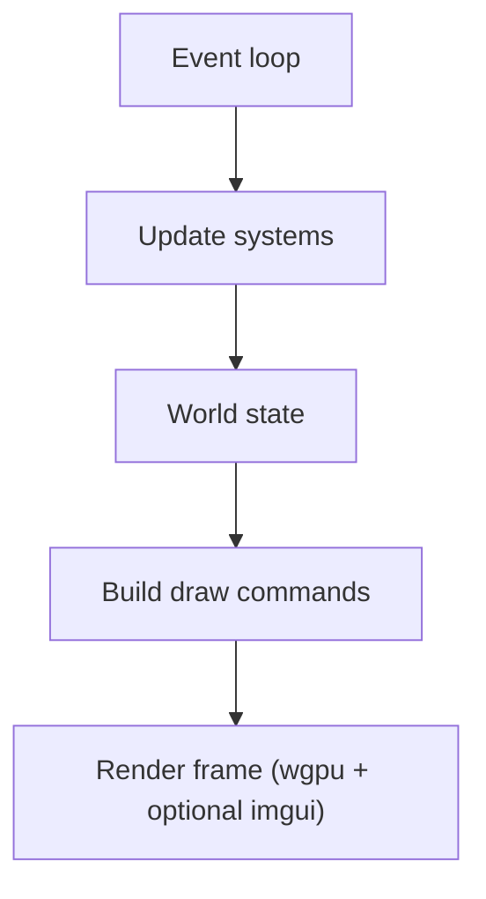

# Forge ECS

A Rust game engine built on the Entity Component System (ECS) design pattern,
with a wgpu renderer, winit windowing, and an imgui debug UI.

---

## Architecture Diagrams

### 1) Multiplayer networking (matchmaking + peer-to-peer gameplay)


### 2) ECS update model and graphics rendering path



---

## Multiplayer demo (quick start)

```bash
# terminal 1: matchmaker (listen on all interfaces)
cargo run --bin matchmaker -- --bind 0.0.0.0:7000

# terminal 2: player client (launcher UI)
cargo run --bin game 
```
Enter 127.0.0.1:7000 as the matchmaker address and click "Connect", then proceed to create or join a lobby. 
If the client runs on another machine, replace `127.0.0.1` with the matchmaker host's LAN IP.

---

## Running the demo

```bash
cargo run --bin demo
```

Requires a working GPU with Vulkan, DX12, or Metal support.

The demo opens a 1280x720 window showing two oscillating shapes:
- An **orange circle** on the left
- A **blue rectangle** on the right

The **"Entity Colors"** imgui window (top-left) lets you:
- Edit RGBA colors for each shape live
- Adjust oscillation frequency (0.1 - 5.0 Hz)
- Adjust oscillation amplitude (10 - 400 px)
